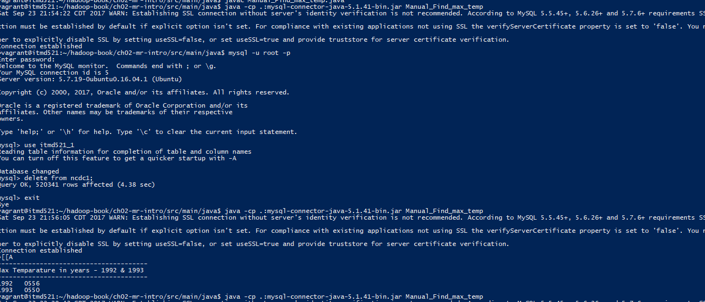
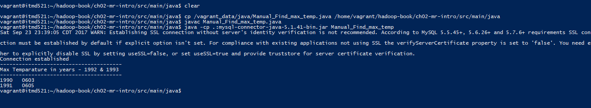

----------------------------
Instruction to run the code:
----------------------------

1. Install mySQL and libraries in server using "apt-get".
2. Login into mySQL server with your username and password using command "mysql -u root -p".
3. Create database and 2 tables using the scripts shown in "DB scripts.SQL" in "files" folder.
4. Move java file(please check inside "files" folder for reference) to server and compile the java file using "javac YOURJAVAFILENAME.java"
5. Execute the compiled class using "java -cp .:mysql-connector-java-5.1.40-bin.jar YOURCLASSNAME".
6. Once all the data is inserted into the mySQL table, the max temperature of specified years will be displayed on the screen. Pls find attched screen shot for reference.

7. Now change the text file in name in the java code and re execute it as shown above and the result is shown in the screen. Pls find attched screen shot for reference.

