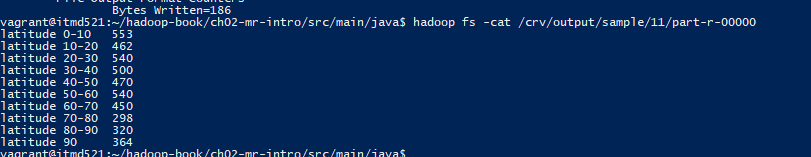
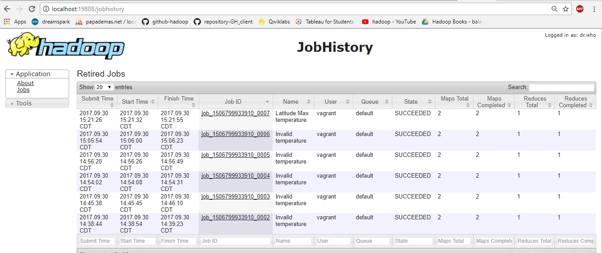

# High Visibility

1. Create the following java file to find the maximum temperature for every 10 degree change in latitude value
 #   a. LatitudeMaxTemperature.java
 #   b. LatitudeMaxTemperatureMapper.java
 #   c. LatitudeMaxTemperatureReducer.java
 #   d. LatitudeMaxTemperatureWithCombiner.java

2. Copy the following java files into local file system using the following command
 #   "cp YOUR_JAVA_FILE YOUR_DESTINATION"

3. Compile the java files using the below command
#    "hadoop com.sun.tools.javac.Main YOUR_JAVA_FILE"

4. Create jar file using the below command
#     "jar cf YOUR_JAR_NAME.jar YOUR_CLASS_NAME*.class"

5. Execute the jar file and store output in hdfs using the below command
#     "hadoop jar YOUR_JAR_FILE_NAME.jar YOUR_CLASS_NAME YOUR_INPUT_FILE YOUR_OUTPUT_PATH"

6. In the output, we could see, maximum temperature for every 10 degree change in latidude. Here the latitude is in degrees. 
In mapper class, we get the data from text file and process each record. Here, we check at 29th position if it falls under ranges of 0 to 10, we send specific 
ID as key to the reducer. In Reducer, we calculate the maximum temperature by looping.

7.Check the output using the below command and check the below screen shot for reference.
#     "hadoop fs -cat YOUR_OUTPUT_FILE"

8. Check the job history at "localhost:19888" and check if the status is "successfull"

