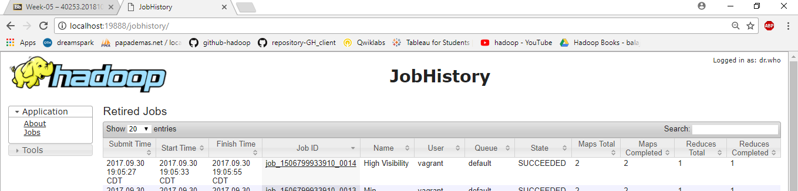

# High Visibility

1. Create the following java file to find the maximum High visibility value
 #   a. HighVisibility.java
 #   b. HighVisibilityMapper.java
 #   c. HighVisibilityReducer.java
 #   d. HighVisibilityWithCombiner.java

2. Copy the following java files into hadoop file system using the following command
 #   "cp YOUR_JAVA_FILE YOUR_DESTINATION"

3. Compile the java files using the below command
#    "hadoop com.sun.tools.javac.Main YOUR_JAVA_FILE"

4. Create jar file using the below command
#     "jar cf YOUR_JAR_NAME.jar YOUR_CLASS_NAME*.class"

5. Execute the jar file and store output in hdfs using the below command
#     "hadoop jar YOUR_JAR_FILE_NAME.jar YOUR_CLASS_NAME YOUR_INPUT_FILE YOUR_OUTPUT_PATH"

6. Check the output using the below command and check the below screen shot for reference.
In the output, we could see the YEAR data with corresponding high visibility in metres 
#     "hadoop fs -cat YOUR_OUTPUT_FILE"

7. Check the job history at "localhost:19888" and check if the status is "successfull"

