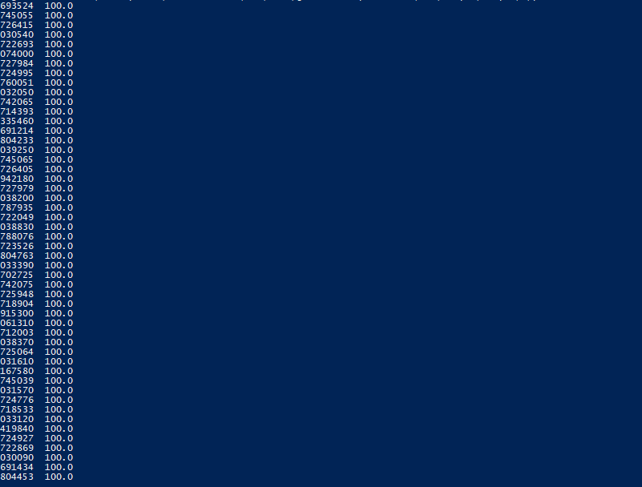
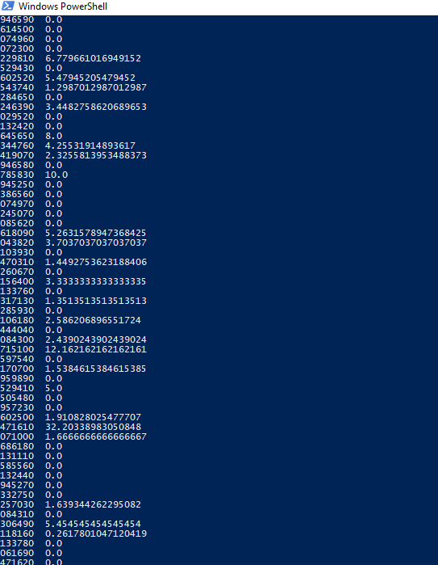
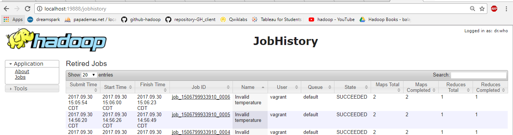

# High Visibility

1. Create the following java file to find the invalid temperature values in station ID value
 #   a. InvalidTemperature.java
 #   b. InvalidTemperatureMapper.java
 #   c. InvalidTemperatureReducer.java
 #   d. InvalidTemperatureWithCombiner.java

2. Copy the following java files into hadoop file system using the following command
 #   "cp YOUR_JAVA_FILE YOUR_DESTINATION"

3. Compile the java files using the below command
#    "hadoop com.sun.tools.javac.Main YOUR_JAVA_FILE"

4. Create jar file using the below command
#     "jar cf YOUR_JAR_NAME.jar YOUR_CLASS_NAME*.class"

5. Execute the jar file and store output in hdfs using the below command
#     "hadoop jar YOUR_JAR_FILE_NAME.jar YOUR_CLASS_NAME YOUR_INPUT_FILE YOUR_OUTPUT_PATH"

6. From mapper class, we find station IDs and corresponding temperature. We concartenate both and send it to reducer with same key.
In reducer, we recieve the data in hashmap and we loop to find the total count and error record count from hashmap.
From total count and count of errored recods we find the percentage of errored records and store it in a collection.
We loop the collection to write data in output.

7. Check the output using the below command and check the below screen shot for reference.
In the output,we could see all the station's ID which has maximum error percentage in temperature readings.
#     "hadoop fs -cat YOUR_OUTPUT_FILE"
Station IDs with Max invalid temperature records Output:

Station IDs with individual temperature records Output:

8. Check the job history at "localhost:19888" and check if the status is "successfull"

