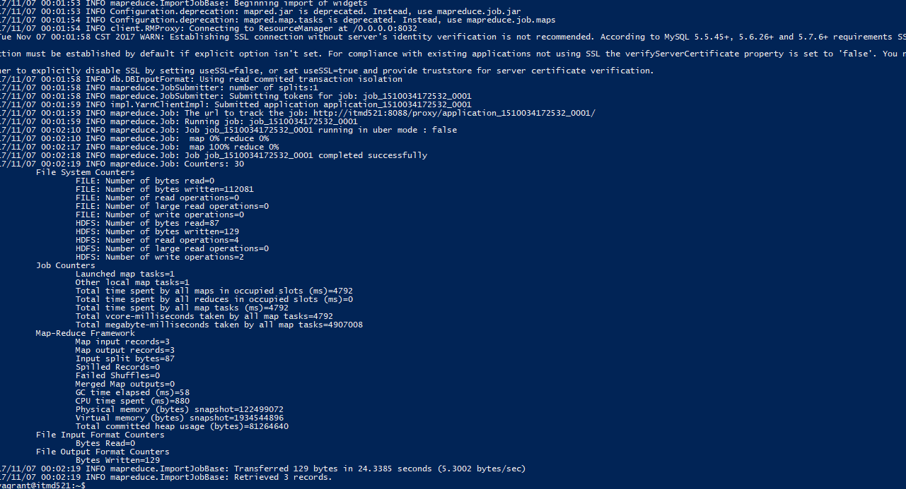
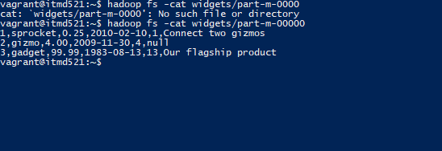
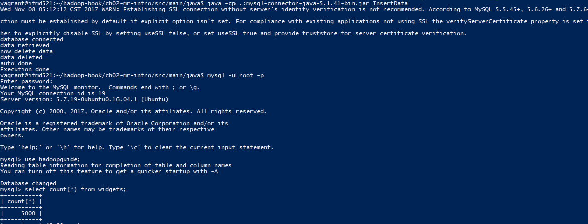
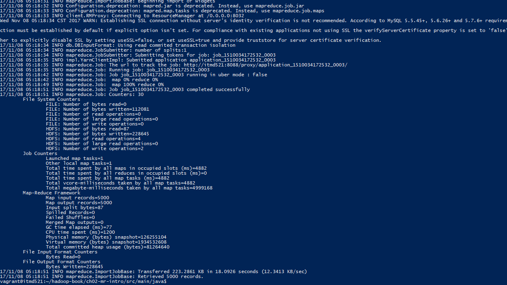
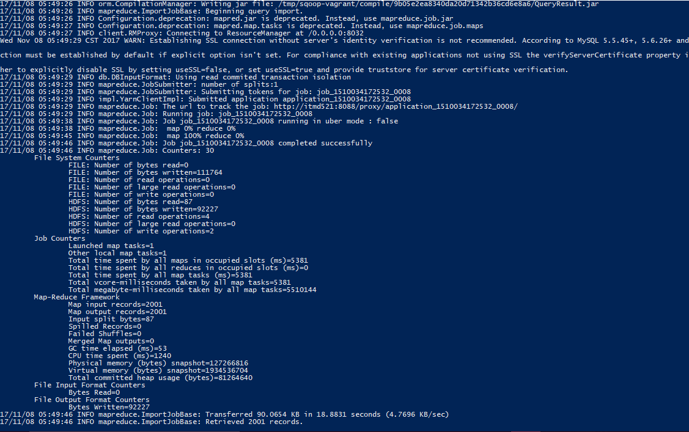
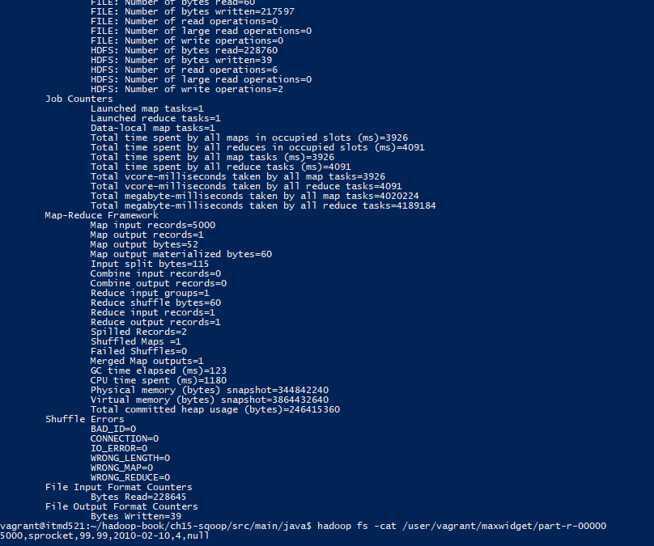
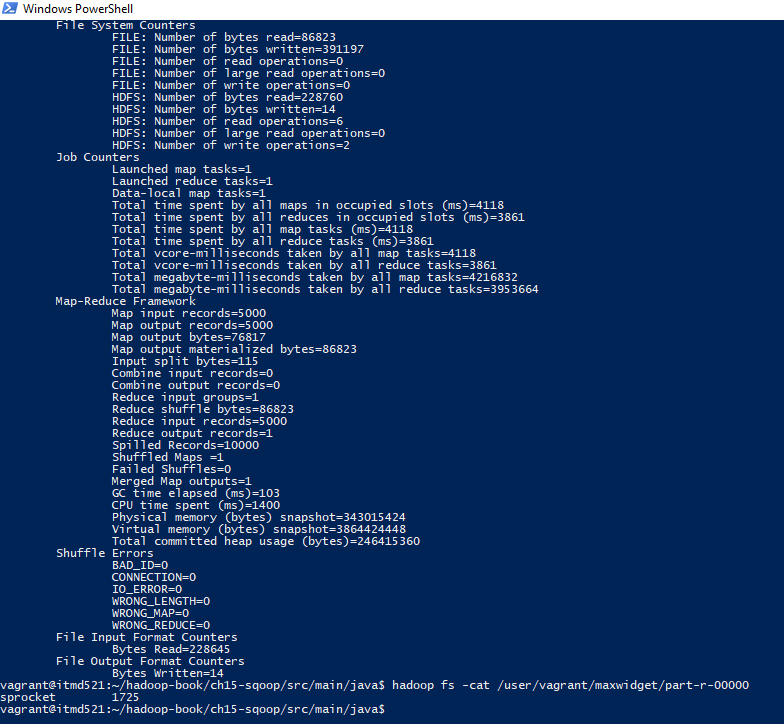

# Vigneshwaarar Chidambaram Rajakannu

# Deliverable 1:
Created a sql script named "create.sql", that will create a database named "hadoopguide", table named "widgets" and inserts 3 given records into the widgets table.
Please check "create.sql" file in files folder for reference.

# Deliverable 2:
A java file named "step-2.java" was created that woukd generate 5000 records using the 3 sample data in widgets table and insert 5000 data into widgets table.
Please check "step-2.java" file in files folder for reference.

# Deliverable 3:
A shell script named "step-3.sh" that will import all the records from widgets table to hdfs.
Please check "step-3.sh" file in files folder for reference.

# Deliverable 4:
A shell script named "step-4.sh" that will import records which ID from 1000-3000 widgets table to hdfs.
Please check "step-4.sh" file in files folder for reference.

# Deliverable 5:
Executed the MaxWidgetId.java and attached the output image in the images folder

# Deliverable 6:
The "MaxWidgetId.java" file has been modified to find the mode of widget name category
Please check "MaxWidgetId.java" file in files folder for reference.
