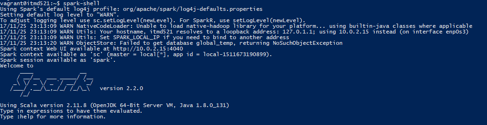

# Vigneshwaarar Chidambaram Rajakannu

# Deliverable C: Install SPARK
To install spark, please execute the following commands,
    hadoop spark downloads
    wget http://apache.mirrors.pair.com/spark/spark-2.2.0/spark-2.2.0-bin-hadoop2.7.tgz
    tar -xvzf spark-2.2.0-bin-hadoop2.7.tgz
    vim  ~/.bashrc

Now add the below lines, at the end of bashrc files
    export JAVA_HOME=/usr
    export HADOOP_HOME=/home/vagrant/hadoop-2.6.5
    export SPARK_HOME=/home/vagrant/spark-2.2.0-bin-hadoop2.7
    export HADOOP_CLASSPATH=/usr/lib/jvm/java-8-openjdk-amd64/lib/tools.jar
    export PATH=$PATH:/sbin:/usr/sbin:/bin:/usr/bin:/home/vagrant/hadoop-2.6.5/bin:/home/vagrant/hadoop-2.6.5/sbin:$SPARK_HOME/bin

If you see the output as shown in the screen shot below, then spark is successfully installed

# Deliverable D:
Now, check the codes folder and run the "code.scala" file
copy it to the home directory and execute the below commands
spark-shell --packages com.databricks:spark-avro_2.11:4.0.0 -i 1code.scala
This will execute all the steps specified in the Deliverables.

# Deliverable E:
Chenck the "Results" folder which has the "Result_0.txt" file, which contains the output of this deliverable

# Deliverable F:
Chenck the "Results" folder which has the "Result_1.txt" file, which contains the output of this deliverable

# Deliverable G:
Chenck the "Results" folder which has the "Result_2.avro" file, which contains the output of this deliverable
