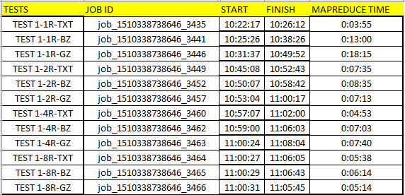
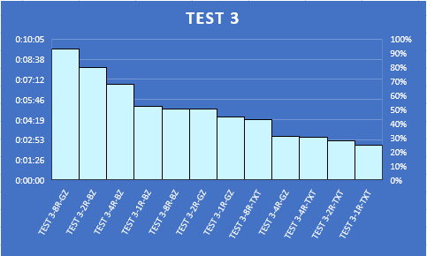

# Week-13 Cluster Assignment

#  Test 1

* Without combiner, without intermediate compression, and 1 reducers
* Without combiner, without intermediate compression, and 2 reducers
* Without combiner, without intermediate compression, and 4 reducers
* Without combiner, without intermediate compression, and 8 reducers

##  Graph



# Observations and Analysis, for TEST 1, from above plot are,
## when we use 1 reducer, with text file as input, the time taken to run job is much lesser compared to other input files like gzip and bzip2
## when we use Gzip file as input and with 1 reducer, time taken to complete the job is very high
## Input file as Text file and bzip files types are more efficient than the gzip file
# As we see in the above plot the gzip files has taken more time to process and this is because, the gzip files cannot be split and the whole dataset is run by a single mapper.
# But when you consider the other file types like text and bzip files the time lapse for running the job is lesser because the input files are split into several input splits and they are processed by several mappers parallelly.
# Text file is 12.18gb so 96 mappers. Bzip2 file is 0.91 gb so 8 mappers. Thus, execution time is very lesser (Page 123 last paragraph)

---

# Test 2

* With combiner, with intermediate compression, and 1 reducers
* With combiner, with intermediate compression, and 2 reducers
* With combiner, with intermediate compression, and 4 reducers
* With combiner, with intermediate compression, and 8 reducers

##  Graph


# Observations and Analysis, for TEST 2, from above plot are,
## when we use 1 reducer, with text file as input, the time taken to run job is much higher compared to other input files like gzip and bzip2
## when we use Gzip file as input and with 8 reducers, time taken to complete the job is less
# In this type, where we use combiner and intermediate compression, the main advantage is the transfer rate from mapper to reducer is high.
# Especially, when output of a mapper is compressed and then fed to reducers, the transfer rate is higher, so time lapse will be less.
# When we use combiners, the output of the mappers which are fed to reducers are reduced and combiner filters each mapper output and this reduced data is fed to reducers. Thus, this method will be so efficient (Page 55 and Page 126 last paragraph)

---

# Test 3

* With combiner, without intermediate compression, and 1 reducers
* With combiner, without intermediate compression, and 2 reducers
* With combiner, without intermediate compression, and 4 reducers
* With combiner, without intermediate compression, and 8 reducers

##  Graph



# Observations and Analysis, for TEST 3, from above plot are,
## when we use 1 reducer, with text file as input, the time taken to run job is much lesser compared to other input files like gzip and bzip2
## when we use Gzip file as input and with 8 reducers, time taken to complete the job is very high
## Input file as Text file and bzip files types are more efficient than the gzip file
# Combiner class is like the reducer class, but it is used to reduce the mapper output before feeding it to reducers.
# For scenarios like, finding a mean or average, we cannot use combiners as finding average for individual mapper outputs is meaningless.
# When we use combiners, the output of the mappers which are fed to reducers are reduced and combiner filters each mapper output and this reduced data is fed to reducers.
# Thus, this method will reduce the amount of data fed to reducers thus, overall execution time is lesser than the without using combiner (Page 55 last paragraph)

---

# Test 4

* Repeat test 1 using the datasets located in: ```/user/ncdc/80/``` (Lastname A-K) and  ```/user/ncdc/90/``` (Lastname L-Z)
* For test 4-6 You will need modify your MaxTemperature code to account for bad records use the sample code on P.174 of textbook *section 6-12* to include a counter that will output the number of bad records at the end of the job -- place this new code and jar file in  Week-13 -> badrecord folder

##  Graph


---
# Observations and Analysis, for TEST 4, from above plot are,
## when we use 4 reducers, with text file as input, the time taken to run job is much lesser compared to other input files like gzip and bzip2
## when we use Gzip file as input and with 2 reducers, time taken to complete the job is very high
## Input file as Text file and bzip files types are more efficient than the gzip file
This test is like Test 1, as we just find the bad files in addition, for bigger dataset.
# As we see in the above plot the gzip files has taken more time to process and this is because, the gzip files cannot be split and the whole dataset is run by a single mapper.
# But when you consider the other file types like text and bzip files the time lapse for running the job is lesser because the input files are split into several input splits and they are processed by several mappers parallelly.
# Text file is 66.27gb so 518 mappers. Bzip2 file is 4.86 gb so 39 mappers. Thus, execution time is very lesser (Page 123 last paragraph)

---

# Test 5

* Repeat test 2 using the datasets located in: ```/user/ncdc/80/``` (Lastname A-K) and  ```/user/ncdc/90/``` (Lastname L-Z)
* For test 4-6 You will need modify your MaxTemperature code to account for bad records use the sample code on P.174 of textbook *section 6-12* to include a counter that will output the number of bad records at the end of the job -- place this new code and jar file in  Week-13 -> badrecord folder

##  Graph


# Observations and Analysis, for TEST 5, from above plot are,
## when we use 1 reducer, with text file as input, the time taken to run job is much lesser compared to other input files like gzip and bzip2
## when we use Gzip file as input and with 2 reducers, time taken to complete the job is very high
## Input file as Text file and bzip files types are more efficient than the gzip file
This test is like Test 2, as we just find the bad files in addition, for bigger dataset.
# In this type, where we use combiner and intermediate compression, the main advantage is the transfer rate from mapper to reducer is high.
# Especially, when output of a mapper is compressed and then fed to reducers, the transfer rate is higher, so time lapse will be less.
# When we use combiners, the output of the mappers which are fed to reducers are reduced and combiner filters each mapper output and this reduced data is fed to reducers. Thus, this method will be so efficient (Page 55 and Page 126 last paragraph)
This test is the best amongst tests 4, 5 and 6, as we use both combiner and intermediate compression.

---

# Test 6

* Repeat test 3 using the datasets located in: ```/user/ncdc/80/``` (Lastname A-K) and  ```/user/ncdc/90/``` (Lastname L-Z)
* For test 4-6 You will need modify your MaxTemperature code to account for bad records use the sample code on P.174 of textbook *section 6-12* to include a counter that will output the number of bad records at the end of the job -- place this new code and jar file in  Week-13 -> badrecord folder

##  Graph


# Observations and Analysis, for TEST 6, from above plot are,
## when we use 4 reducers, with text file as input, the time taken to run job is much lesser compared to other input files like gzip and bzip2
## when we use Gzip file as input and with 2 reducers, time taken to complete the job is very high
## Input file as Text file and bzip files types are more efficient than the gzip file
This test is like Test 3, as we just find the bad files in addition, for bigger dataset.
# Combiner class is like the reducer class, but it is used to reduce the mapper output before feeding it to reducers.
# For scenarios like, finding a mean or average, we cannot use combiners as finding average for individual mapper outputs is meaningless.
# When we use combiners, the output of the mappers which are fed to reducers are reduced and combiner filters each mapper output and this reduced data is fed to reducers.
# Thus, this method will reduce the amount of data fed to reducers thus, overall execution time is lesser than the without using combiner (Page 55 last paragraph).
This test is second best among 4, 5 and 6 tests. It falls behind test 5 where we use both combiner and intermediate compression

---

# Test 7

* Repeat test 1 using the datasets located in: ```/user/ncdc/80-90/```  (ALL students)

##  Graph


# Observations and Analysis, for TEST 7, from above plot are,
## when we use 4 reducers, with text file as input, the time taken to run job is much lesser compared to bzip2
## when we use bzip2 file as input and with 8 reducers, time taken to complete the job is very high
## Input file as Text file types are more efficient than the bzip2 file
This test is like Test 1 for bigger dataset for 80-90
# Text file is 169.54 gb so 1325 mappers. Bzip2 file is 12.4 gb so 97 mappers. Thus, execution time reduces as mappers run in parallel. (Page 123 last paragraph)

---

# Test 8

* Repeat test 2 using the datasets located in: ```/user/ncdc/80-90/```  (ALL students)

##  Graph


# Observations and Analysis, for TEST 8, from above plot are,
## when we use 4 reducers, with text file as input, the time taken to run job is much lesser compared to bzip2
## when we use bzip2 file as input and with 8 reducers, time taken to complete the job is very high
## Input file as Text file types are more efficient than the bzip2 file
This test is like Test 2 for bigger dataset i.e., 80-90 years
# In this type, where we use combiner and intermediate compression, the main advantage is the transfer rate from mapper to reducer is high.
This test is the best amongst tests 7, 8 and 9, as we use both combiner and intermediate compression.

---

# Test 9

* Repeat test 3 using the datasets located in: ```/user/ncdc/80-90/```  (ALL students)

##  Graph


# Observations and Analysis, for TEST 9, from above plot are,
## when we use 2 reducers, with bzip2 file as input, the time taken to run job is much lesser compared to bzip2
## when we use bzip2 file as input and with 8 reducers, time taken to complete the job is very high
## Input file as Text file types are more efficient than the bzip2 file
This test is like Test 3 for bigger dataset i.e., 80-90 years

---

# Test 10

* Repeat test 1 using the dataset and the ```/user/ncdc/256/80-90/``` datasets (ALL students)
   + This increases the default Block Size to 256 mb

##  Graph


# Observations and Analysis, for TEST 10, from above plot are,
## when we use 4 reducers, with text file as input, the time taken to run job is much lesser compared to using 1, 2 or 8 reducers.
## when we use text file as input and with 8 reducers, time taken to complete the job is very high
## Now, we compare the test 10 results, where we use 256 MB as block size, with the test 7, where we use the 128 MB as block size.
## We could clearly see that increase in block size reduces the execution time. For example, consider text file as input and executed with 8 reducers. In test 7, the execution time was over 1hr 30mins and here, the execution time for the same file type and same number of reducer, is 43mins

---

# Test 11

* Repeat test 2 using the dataset and the ```/user/ncdc/256/80-90/``` datasets (ALL students)
   + This increases the default Block Size to 256 mb

##  Graph


# Observations and Analysis, for TEST 11, from above plot are,
## when we use 2 reducers, with text file as input, the time taken to run job is much lesser compared to using 1, 4 or 8 reducers.
## when we use text file as input and with 1 reducer, time taken to complete the job is very high
## Now, we compare the test 11 results, where we use 256 MB as block size, with the test 8, where we use the 128 MB as block size.
## We could clearly see that increase in block size reduces the execution time. For example, consider text file as input and executed with 1 reducer. In test 8, the execution time was over 1hr 40mins and here, the execution time for the same file and same number of reducer, is 1hr 4mins

---

# Test 12

* Repeat test 3 using the dataset and the ```/user/ncdc/256/80-90/``` datasets (ALL students)
   + This increases the default Block Size to 256 mb

##  Graph


# Observations and Analysis, for TEST 12, from above plot are,
## when we use 2 reducers, with text file as input, the time taken to run job is much lesser compared to using 1, 4 or 8 reducers.
## when we use text file as input and with 8 reducers, time taken to complete the job is very high
## Now, we compare the test 12 results, where we use 256 MB as block size, with the test 9, where we use the 128 MB as block size.
## We could clearly see that increase in block size reduces the execution time. For example, consider text file as input and executed with 1 reducer. In test 9, the execution time was over 1hr and here, the execution time for the same file and same number of reducer, is 40mins

---

# Test 13

* Repeat test 1 using the dataset and the ```/user/ncdc/512/80-90/``` datasets (ALL students)
   + This increases the default Block Size to 512 mb

##  Graph


# Observations and Analysis, for TEST 13, from above plot are,
## when we use 4 reducers, with text file as input, the time taken to run job is much lesser compared to using 1, 2 or 8 reducers.
## when we use text file as input and with 1 reducer, time taken to complete the job is very high
## As the block size increases the execution time reduces but here as the file size was not very large, the time taken to process each input split increases. May be because of this execution time was high. When the dataset size is over 1TB, we can use 512MB block size.

---

# Test 14

* Repeat test 2 using the dataset and the ```/user/ncdc/512/80-90/``` datasets (ALL students)
   + This increases the default Block Size to 512 mb

##  Graph


# Observations and Analysis, for TEST 14, from above plot are,
## when we use 1 reducer, with text file as input, the time taken to run job is much lesser compared to using 2, 4 or 8 reducers.
## when we use text file as input and with 8 reducers, time taken to complete the job is very high
## Now, we compare the test 14 results, where we use 512 MB as block size, with the test 11, where we use the 256 MB as block size.
## We could clearly see that increase in block size reduces the execution time. For example, consider text file as input and executed with 1 reducer. In test 11, the execution time was over 1hr 5mins and here, the execution time for the same file and same number of reducer, is 14mins

---

# Test 15

* Repeat test 3 using the dataset and the ```/user/ncdc/512/80-90/``` datasets (ALL students)
   + This increases the default Block Size to 512 mb

##  Graph


# Observations and Analysis, for TEST 15, from above plot are,
## when we use 2 reducers, with text file as input, the time taken to run job is much lesser compared to using 1, 4 or 8 reducers.
## when we use text file as input and with 8 reducers, time taken to complete the job is very high
## Now, we compare the test 15 results, where we use 512 MB as block size, with the test 12, where we use the 256 MB as block size.
## We could clearly see that increase in block size reduces the execution time. For example, consider text file as input and executed with 2 reducers. In test 12, the execution time was over 40mins and here, the execution time for the same file and same number of reducer, is 36mins

---

# Test 16

* Using the datasets contained in ```/user/logs/large-logs``` write and compile a MapReduce Program to do the following: For each month in the year find the page (html or php) name that has the highest number of HTTP 200 responses that is not the index.* page as well as the number (count) of those results graphed together.  Use the following years and files:
    + Lastname A-E 2012 + 2013
    + Lastname F-N 2014 + 2015
    + Lastname O-Z 2016 + 2012
    + ```web-server-logs.txt```
    + ```web-server-logs.bz2```
    + ```web-server-logs.gz```
*  Graph the retrieved data, based on results of previous 15 tests, you decide the single configuration that is optimum for achieving the results and explain why you chose that configuration for this test.  Include your code inside your Github account in a folder named test-16.  Make sure all coded needed to compile and run the job is present.  Add a ReadMe.md with any instructions or assumptions in that folder.

##  Graph


# Above output shows the overall execution time comparison for all the 15 tests we performed earlier
## For gzip files test with 1 reducer, with combiner and with intermediate compression executes faster than other tests
## For text files inputs, with 4 reducers, with combiner and with intermediate compression executes faster than other tests
## For bzip2 files test with 1 reducer, with combiner and with intermediate compression executes faster than other tests

---

# Conclusion (test 17)

Write your general conclusion and recommendation for the optimal performance characteristics relating to **intermediate compression**, **compression**, **combiners**, **block size**, and **number of reducers** based on this work load and dataset results (reference your test results above).

Thus, from our above tests, we can conclude the following,
# If the input is compressed file or not, when output of a mapper is compressed and then fed to reducers, the transfer rate is higher, so time lapse will be less.
# When we use combiners, the output of the mappers which are fed to reducers are reduced and combiner filters each mapper output and this reduced data is fed to reducers. Even in this case execution time will decrease
# Increase in block size will also reduce the execution time. When the dataset is huge, say 1TB, usage of bigger block size will be helpful. Because, the data each mapper and reducer can handle will also increase. So, there can be decrease in execution time.
# Using compressed files as input, is advantageous, when the inputs can be split and fed to the mappers. In our tests, execution time for gzip was generally high because, the gzip files can’t be split so only one mapper will be processing the full input
